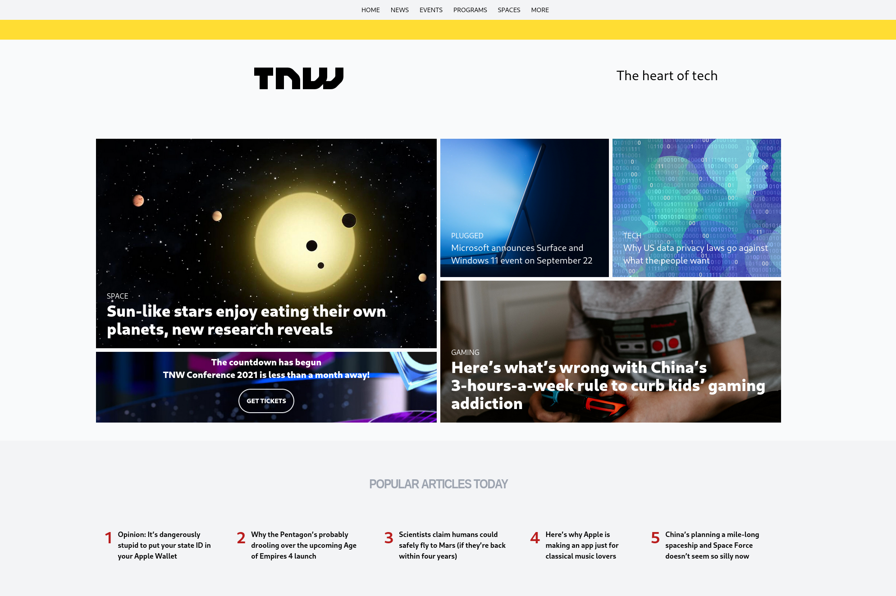

# [TheOdinProject](https://www.theodinproject.com/)

## Project: Building with Responsive Design



Cloned [The Next Web](https://thenextweb.com/) using [Tailwind CSS](https://tailwindcss.com/)

## Features

- Fully responsive
- Almost an exact 1/1 

## Installation

Clone the repository:

```bash
git clone https://github.com/Alberinea/tnw-clone.git
```

Open the project folder:

```bash
cd tnw-clone
```

Install all dependencies:

```bash
npm i
```

Open index.html to run the project.

## Demo

[Live Demo](https://alberinea.github.io/tnw-clone)
